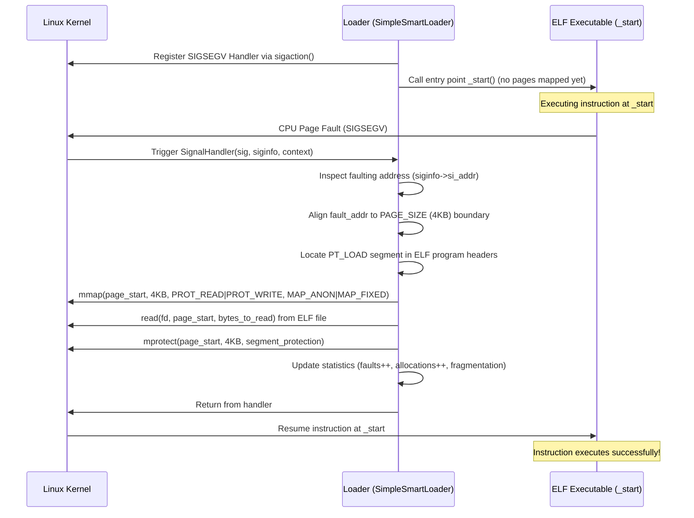
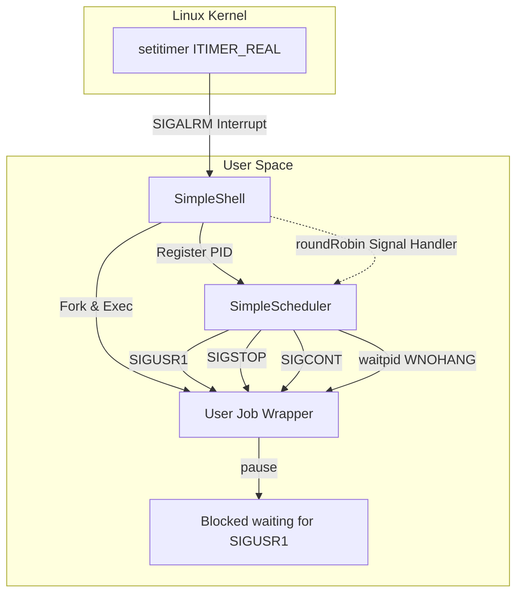
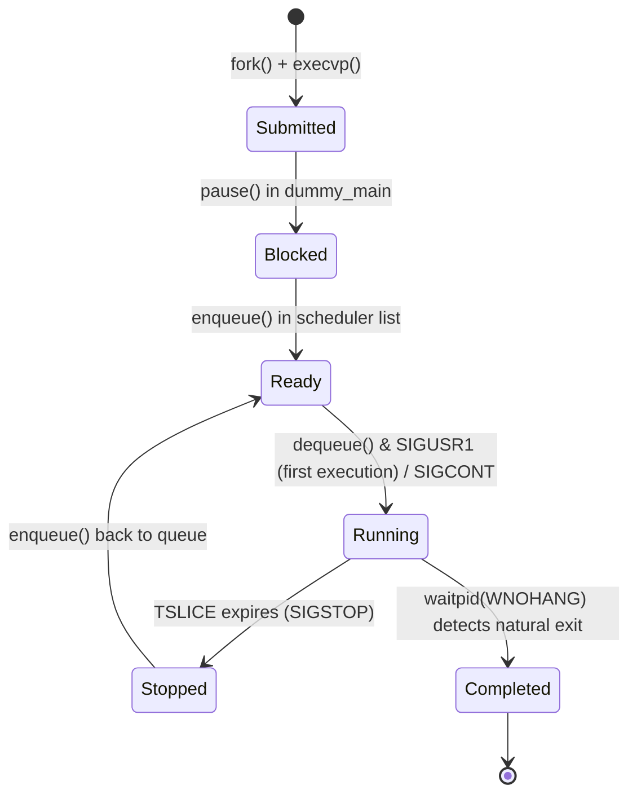

# Custom Linux OS Components: Smart Loader & Preemptive User-Space Scheduler

[](https://en.wikipedia.org/wiki/C_(programming_language))
[](https://en.wikipedia.org/wiki/POSIX)
[](https://www.gnu.org/software/make/)
[](https://opensource.org/licenses/MIT)

A high-performance systems engineering project implementing core Operating System concepts in user-space on Linux. This repository features two main components:
1. **Smart Loader**: A custom ELF executable loader implementing **user-space demand paging** by trapping page faults (`SIGSEGV`) and dynamically mapping pages via `mmap` and `mprotect`.
2. **Simple Scheduler**: A multi-core preemptive **Round-Robin CPU Scheduler** running in user-space, driving execution using interval timers (`setitimer`), signal-based process control (`SIGSTOP`/`SIGCONT`/`SIGUSR1`), and tracking micro-accounting statistics.

---

## Table of Contents
- [Overview](#overview)
- [Key Features](#key-features)
- [Tech Stack](#tech-stack)
- [System Architecture](#system-architecture)
  - [1. Smart Loader Architecture](#1-smart-loader-architecture)
  - [2. Simple Scheduler Architecture](#2-simple-scheduler-architecture)
- [Project Structure](#project-structure)
- [Installation & Prerequisites](#installation--prerequisites)
- [Configuration](#configuration)
- [Usage](#usage)
  - [Running the Smart Loader](#running-the-smart-loader)
  - [Running the Simple Scheduler](#running-the-simple-scheduler)
- [Core Workflows](#core-workflows)
  - [Demand Paging Workflow](#demand-paging-workflow)
  - [Round-Robin Scheduling Cycle](#round-robin-scheduling-cycle)
- [Technical Highlights](#technical-highlights)
  - [Engineering Decisions](#engineering-decisions)
  - [Performance Optimizations](#performance-optimizations)
  - [Security Considerations](#security-considerations)
- [Challenges & Solutions](#challenges--solutions)
- [API Reference & Interfaces](#api-reference--interfaces)
- [In-Memory Data Structures (Database Design)](#in-memory-data-structures-database-design)
- [Testing Strategy](#testing-strategy)
- [Future Production-Grade Improvements](#future-production-grade-improvements)
- [Learnings & Takeaways](#learnings--takeaways)
- [Authors](#authors)

---

## Overview

Modern kernels abstract memory virtualization and process scheduling, hiding the underlying mechanics from application developers. This project strips away that abstraction by implementing **demand paging** and **preemptive scheduling** inside user-space.

### The Problems Solved:
- **Inefficient Memory Utilization**: Executables are typically loaded entirely into RAM. The **Smart Loader** solves this by loading pages of an ELF binary on-demand, minimizing the initial physical memory footprint of a process.
- **User-Space Process Orchestration**: Standard process execution is scheduled solely by the Linux kernel. The **Simple Scheduler** implements a customized, predictable Round-Robin scheduling policy that runs on top of the OS, regulating CPU resource allocation for specific batches of user jobs.

This project is a demonstration of low-level systems programming, POSIX signal handling, memory protection manipulation, and process control.

---

## Key Features

### 1. Smart Loader
* **Demand Paging**: Zero memory pages of the ELF binary are loaded at startup. Pages are mapped on-demand only when executed or read/written.
* **Interrupt-Driven Mapping**: Catches `SIGSEGV` signals triggered by accessing unmapped virtual memory, parses the faulting address, maps a page, and resumes execution seamlessly.
* **Segment Protection Enforcement**: Translates ELF segment flags (`PF_R`, `PF_W`, `PF_X`) to corresponding memory protections (`PROT_READ`, `PROT_WRITE`, `PROT_EXEC`) using `mprotect`.
* **Telemetry & Accounting**: Tracks and reports total page faults, page allocations, and exact internal fragmentation down to the byte.

### 2. Simple Scheduler
* **Multi-CPU Round-Robin Scheduling**: Dispatches up to `NCPU` jobs concurrently in a round-robin queue, ensuring fairness.
* **Microsecond-Precision Preemption**: Employs real-time interval timers (`setitimer`) to generate interrupts every `TSLICE` milliseconds.
* **Execution Interception Wrapper**: Leverages a preprocessor macro hook (`dummy_main.h`) to intercept the entry point of user jobs, blocking them via `pause()` until they receive their first scheduling token (`SIGUSR1`).
* **Signal-Based Process Control**: Pauses jobs using `SIGSTOP` and resumes them using `SIGCONT`, ensuring zero CPU cycles are wasted by suspended jobs.
* **Detailed Job Telemetry**: Records start times, end times, total executed slices, and computes total wait times.

---

## Tech Stack

* **System Language**: C (POSIX-compliant C99 / GNU extension `_GNU_SOURCE`)
* **Operating System**: Linux (tested on Ubuntu/Debian compatible distributions)
* **Binary Format**: ELF-32 (Executable and Linkable Format, 32-bit architecture)
* **Build System**: GNU Make
* **Core POSIX APIs**: 
  - **Memory Management**: `mmap()`, `mprotect()`, `munmap()`
  - **Process Lifecycle**: `fork()`, `execvp()`, `waitpid()`
  - **Signal Handling**: `sigaction()`, `sigprocmask()`, `kill()`, `pause()`
  - **Timers**: `setitimer()`

---

## System Architecture

### 1. Smart Loader Architecture

The Smart Loader hijacks the execution flow of an ELF executable, catching page faults and mapping memory on demand.



### 2. Simple Scheduler Architecture

The scheduler controls process concurrency. It intercepts user jobs using a wrapper header, keeping them blocked until scheduled, and periodically rotates running processes.



#### Job Lifecycle State Machine



---

## Project Structure

```
.
├── Loader/                     # Smart Loader Component
│   ├── launcher/               # Host executable wrapper
│   │   ├── Makefile            # Launcher Makefile
│   │   └── launch.c            # Verifies executable path and executes loader
│   ├── loader/                 # Core Smart Loader shared library
│   │   ├── Makefile            # Loader Shared Library Makefile
│   │   ├── loader.c            # Implements demand paging and ELF parsing
│   │   └── loader.h            # Exported Loader API
│   ├── test/                   # Test Suite
│   │   ├── Makefile            # Compiles test cases (nostdlib, m32)
│   │   ├── fib.c               # Test executable: Fibonacci calculation
│   │   └── sum.c               # Test executable: Array summation (causes faults)
│   ├── Makefile                # Root Makefile for Loader
│   └── README.md               # Loader documentation
│
├── Scheduler/                  # User-Space Preemptive Scheduler Component
│   ├── Makefile                # Scheduler & Jobs Makefile
│   ├── SimpleScheduler.c       # Implements Round-Robin, queues, and signal handlers
│   ├── SimpleShell.c           # CLI interface for submitting and running jobs
│   ├── dummy_main.h            # Preprocessor hook to intercept user processes
│   ├── job.c                   # CPU-bound test job
│   ├── scheduler.h             # Scheduler exported functions
│   └── README.md               # Scheduler documentation
│
└── README.md                   # Main Project Documentation (This File)
```

---

## Installation & Prerequisites

This project targets **32-bit x86 architectures** for binary loading and uses POSIX interfaces. On modern 64-bit systems, you must install the multiarch compiler tools to compile 32-bit binaries.

### Prerequisites (Ubuntu/Debian)
```bash
sudo apt-get update
sudo apt-get install -y build-essential gcc-multilib
```

### Build Instructions
Build the entire suite (Loader and Scheduler components) by compiling in both subdirectories:

```bash
# Build Loader Components
cd Loader
make clean && make
cd ..

# Build Scheduler Components
cd Scheduler
make clean && make
cd ..
```

---

## Configuration

The **Simple Scheduler** accepts two dynamic CLI configuration parameters:
- `NCPU`: The number of processes that are allowed to run concurrently in the scheduler execution slice.
- `TSLICE`: The length of the scheduler time slice in milliseconds (converts to `SIGALRM` timeouts).

No environment variables or external configuration files are needed; execution is fully self-contained.

---

## Usage

### Running the Smart Loader

The launcher executes an ELF-32 binary, trapping faults and executing it page-by-page.

```bash
cd Loader
# Running the Fibonacci test binary
./bin/launch ./test/fib

# Running the Array Sum test binary (which triggers data page faults)
./bin/launch ./test/sum
```

#### Expected Output (Demand Paging Statistics)
```text
User _start return value = 2048

--- SimpleSmartLoader Stats ---
Total Page Faults: 3
Total Page Allocations: 3
Total Internal Fragmentation: 7.89 KB
```

### Running the Simple Scheduler

Run the shell passing the CPU limit and time quantum (in milliseconds):

```bash
cd Scheduler
# Start SimpleShell with 2 CPU slots and a 150ms time slice
./SimpleShell 2 150
```

Inside `SimpleShell`, you can run standard Linux commands synchronously, or submit CPU-intensive jobs to be run preemptively by the scheduler:

```bash
# Submit multiple instances of the test job
SimpleShell~$ submit ./job
SimpleShell: Submitted process 15201
SimpleShell~$ submit ./job
SimpleShell: Submitted process 15203
SimpleShell~$ submit ./job
SimpleShell: Submitted process 15206

# View real-time output showing jobs preempting and resuming...
# Type exit to shutdown the shell, terminate remaining jobs, and view metrics
SimpleShell~$ exit
```

#### Expected Output (Scheduler Stats)
```text
SimpleShell shutting down. Waiting for all jobs to complete...
Received SIGUSR1 signal. Resuming execution.
Job with PID 15201 starting...
Job with PID 15201 finished.
...

-- Statistics (TSLICE = 150ms) --
Name                 PID      Completion Time           Wait Time           
------------------------------------------------
./job                15201    24 x 150ms                12 x 150ms          
./job                15203    28 x 150ms                16 x 150ms          
./job                15206    31 x 150ms                19 x 150ms          
------------------------------------------------------------
```

---

## Core Workflows

### Demand Paging Workflow
1. The **Loader** reads the ELF headers, identifying the memory size and entry point (`_start`).
2. It registers the `SIGSEGV` signal handler.
3. The Loader calls the function pointer pointing to `_start`.
4. As `_start` executes, it triggers a page fault because the memory address is unmapped.
5. The kernel traps the page fault and raises `SIGSEGV`.
6. The loader's `SignalHandler` intercepts it, calculates the faulting address, and queries ELF program headers to ensure the address falls inside a valid loadable (`PT_LOAD`) segment.
7. It calls `mmap` to allocate a 4KB page at the aligned page address.
8. It reads file content from the ELF binary corresponding to that page offset and copies it to RAM.
9. It adjusts page protection flags using `mprotect` to match ELF segment permissions.
10. The handler returns, and the CPU retries the instruction.

### Round-Robin Scheduling Cycle
1. A user binary is compiled with the `dummy_main.h` header, wrapping its entry point inside a `pause()` system call.
2. The user submits a job via `SimpleShell`.
3. The shell `fork`s a child, which calls `execvp` to load the binary. The binary immediately halts at `pause()`, waiting for `SIGUSR1`.
4. The parent shell registers the child PID with the scheduler.
5. Every `TSLICE` milliseconds, `setitimer` triggers `SIGALRM`.
6. The `roundRobin` handler catches the alarm and:
   - Queries `waitpid(..., WNOHANG)` to prune terminated jobs.
   - Sends `SIGSTOP` to all currently running processes.
   - Enqueues suspended processes back to the ready queue.
   - Dequeues the next `NCPU` processes.
   - Sends `SIGUSR1` (if first run) or `SIGCONT` (if resuming) to start execution.

---

## Technical Highlights

### Engineering Decisions

| Feature | Design Chosen | Rationale |
|---|---|---|
| **Binary Setup** | `-nostdlib` & `-no-pie` | Bypasses standard libc initialization vectors, allowing direct invocation of `_start` without stack setup complications, and maps virtual addresses to fixed offsets matching the ELF header. |
| **Startup Hijack** | `#define main dummy_main` | Simple preprocessor redirection that avoids complex runtime linking tricks (such as `LD_PRELOAD`) or process tracing (`ptrace`). |
| **Memory Allocation** | `MAP_FIXED` | Ensures pages are mapped at the exact virtual address expected by the un-relocated ELF binary. |
| **Concurrency Protection**| Signal Blocking (`sigprocmask`) | Prevents nested interrupts during queue modification, preventing race conditions or deadlock. |

### Performance Optimizations
* **Zero-Pre-allocation**: By mapping memory pages only upon a page fault, RAM usage scales directly with the code path executed. Dead or unused sections of the binary are never loaded.
* **Non-Blocking Harvesting**: Uses `waitpid(WNOHANG)` to reap terminated children during scheduler ticks. This avoids blocking the scheduler thread while checking for job completion.
* **Low-Overhead Context Switching**: Rather than using heavy virtualization, context switching leverages the kernel's native signal scheduler (`SIGSTOP`/`SIGCONT`), keeping overhead minimal.

### Security Considerations
* **Page-Aligned Memory Protections**: Using `mprotect` restricts permissions of demand-mapped memory segments to match ELF header definitions. Executables segments are read/execute only (`PROT_READ | PROT_EXEC`), and data segments are read/write only (`PROT_READ | PROT_WRITE`), mitigating arbitrary code execution exploits.
* **Signal Isolation**: The scheduler blocks signals inside critical sections using `sigprocmask(SIG_SETMASK, &mask, &old)`, protecting internal list states from concurrent interrupt handler invocations.

---

## Challenges & Solutions

### Challenge 1: Emulating OS Page Faults in User-Space without infinite loops
* *The Problem*: When a page fault occurs, the CPU jumps to the signal handler. If the signal handler returns without fixing the memory violation, the CPU re-executes the same instruction, triggering another `SIGSEGV`, causing an infinite loop.
* *The Solution*: In the handler, the faulting address is retrieved using `siginfo_t*->si_addr`. The memory page containing that address is mapped using `mmap(..., MAP_FIXED)` with `PROT_READ | PROT_WRITE` permissions, populated with the exact binary slice read from the disk, and then locked down using `mprotect` to the original segment protection before returning. When the handler exits, the CPU re-executes the instruction successfully.

### Challenge 2: Synchronizing Process Execution with Scheduler Startup
* *The Problem*: When `SimpleShell` forks a child to execute a job, the child begins executing immediately. If the scheduler is busy, the job runs out-of-turn, bypassing scheduling.
* *The Solution*: We engineered `dummy_main.h`, redefining the user's `main` to `dummy_main`. The compiler inserts our stub `main`, which registers a signal handler for `SIGUSR1` and calls `pause()`. The child process suspends execution immediately upon spawning. The scheduler sends `SIGUSR1` only when the process is dequeued for its first time-slice, waking it up to run.

---

## API Reference & Interfaces

### 1. Smart Loader API (`loader.h`)
* `void load_and_run_elf(char** exe)`
  * *Description*: Parses the ELF binary, registers the signal handler, jumps to the entry point, executes, and displays final page statistics.
  * *Parameters*: `exe` - Null-terminated array of arguments (where `exe[1]` is the path to the ELF file).
* `void loader_cleanup()`
  * *Description*: Loops through all mapped pages and unmaps them, closes the ELF file descriptor, and frees heap-allocated headers.

### 2. Scheduler API (`scheduler.h`)
* `void initializeScheduler(int NCPU, int TSLICE)`
  * *Description*: Allocates scheduler structures, binds `SIGALRM` to the scheduler handler, and starts the real-time periodic timer.
* `void submitProcess(pid_t pid, char *arg)`
  * *Description*: Instantiates metadata tracking structures for a process and enqueues it.
* `void roundRobin(int signum)`
  * *Description*: Timer interrupt handler (`SIGALRM`). Performs process accounting, suspends running processes, and dispatches the next batch of ready processes.
* `void stopScheduler()`
  * *Description*: Disables the timer, sends `SIGCONT` to all processes to let them run to completion, and blocks (`waitpid`) until all active processes exit.
* `void print_stats()`
  * *Description*: Traverses process lists, calculates completion/wait metrics, prints tables, and cleans up heap memory.

---

## In-Memory Data Structures (Database Design)

Since this is a low-level systems application, data management is handled entirely in-memory using dynamic, pointer-linked lists optimized for fast queue insertion and traversal.

### 1. Process Database Layout (`ProcessInfo`)
```c
typedef struct ProcessInfo {
    pid_t pid;                      // Primary Key: Unique POSIX Process Identifier
    struct ProcessInfo* next;       // Queue Link: Ptr to next element in the ready queue
    int startTime;                  // Telemetry: Tick count when process was submitted
    int endTime;                    // Telemetry: Tick count when process terminated
    int executed_slices;            // Accounting: Number of scheduling slices received
    char cmdname[256];              // Metadata: Executable filename
    struct ProcessInfo* next_process;// Master List Link: Ptr to next element in master list
} ProcessInfo;
```

### 2. Relations & Collections
* **Master Process List**: A singly-linked list pointed to by `processList`. Serves as the master registry of all submitted processes. Retains process telemetry even after the process exits or is dequeued.
* **Ready Queue**: A FIFO queue linked via the `next` pointer, managed by `ready_queue` (head) and `last_in_queue` (tail) pointers. Enables $O(1)$ enqueue and dequeue operations.

---

## Testing Strategy

The project contains test cases built to validate demand paging behavior and preemptive scheduling behavior.

### 1. Smart Loader Tests
Located under `Loader/test/`:
- `fib.c`: A recursion-heavy CPU computation binary. Tests the loader's capability to load instructions page-by-page.
- `sum.c`: Declares a large static array `A` page-aligned via `__attribute__((aligned(4096)))`. Accesses this array sequentially, triggering page faults at specific addresses. Tests the handler's ability to locate and map data segments in addition to text segments.

#### Test Execution:
```bash
cd Loader
make test
./bin/launch ./test/fib
./bin/launch ./test/sum
```

### 2. Scheduler Tests
Located under `Scheduler/`:
- `job.c`: A CPU-bound busy-loop process. Emits start/end statements and runs for approximately 2 billion iterations. Used to verify preemption, preemption logs, and telemetry output during overlapping execution cycles.

#### Test Execution:
```bash
cd Scheduler
make
./SimpleShell 2 100
# Inside shell, submit multiple CPU jobs:
submit ./job
submit ./job
submit ./job
exit
```

---

## Future Production-Grade Improvements

* **x86_64 ELF Support**: Expand the ELF parsing module to support 64-bit ELF headers (`Elf64_Ehdr`, `Elf64_Phdr`) to remove the dependency on `gcc-multilib` and run native 64-bit binaries.
* **Dynamic Page Directory**: Replace the fixed-size `mapped_pages` array in `loader.c` with a dynamic hash-map or radix-tree structure to support executables that span more than 10,000 pages.
* **I/O Non-Blocking Yielding**: Implement syscall interception (via `ptrace` or user-level threading wrappers) to yield a process's timeslice to the scheduler when it blocks on I/O.
* **Multi-Priority Queues**: Transition the scheduler from a strict single-level Round-Robin queue to a Multi-Level Feedback Queue (MLFQ) to optimize scheduling based on process behavior.
* **Argument & Environment Passing**: Enhance `load_and_run_elf` to construct a simulated stack frame containing `argc`, `argv`, and `envp` pointers so loaded binaries can receive input parameters.

---

## Learnings & Takeaways

1. **POSIX Memory Control**: Gained deep experience with memory page management, understanding how virtual memory offsets map directly to file offsets, and how `mmap` is utilized under-the-hood by system loaders.
2. **Asynchronous Signal Handling**: Developed robust techniques to manage asynchronous traps (`SIGSEGV`, `SIGALRM`), learning the importance of signal masking, atomic flags, and avoiding non-reentrant calls (like `printf`) inside signal handlers.
3. **Process Life Cycles & State Control**: Acquired hands-on knowledge of UNIX process state control and scheduling loops, mastering the orchestration of child processes using signals.

---

## Authors

* **Rohan Singh** (2024477)
* **Agrim Verma** (2024047)
